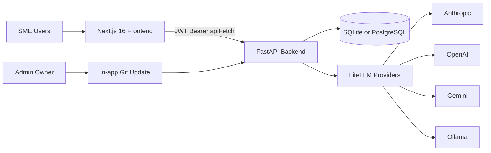
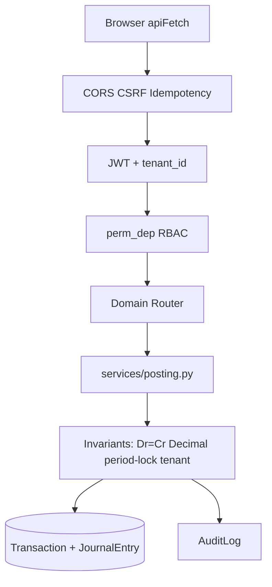
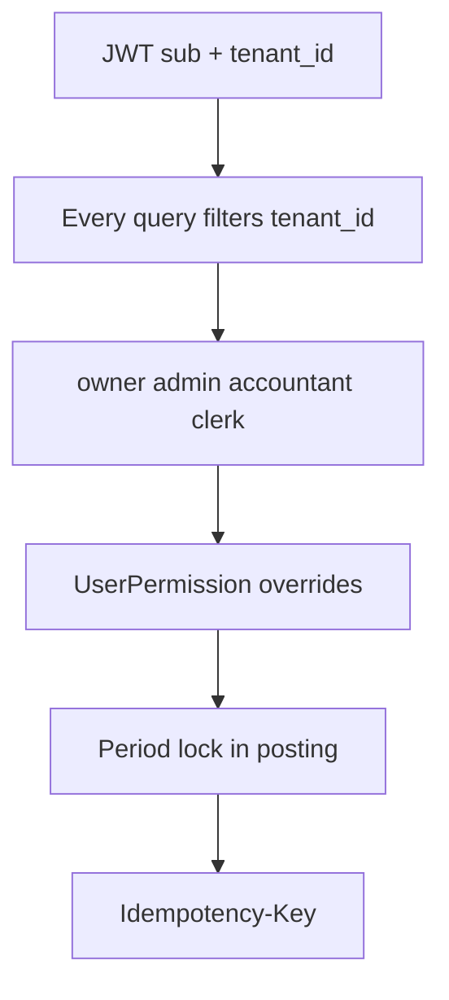
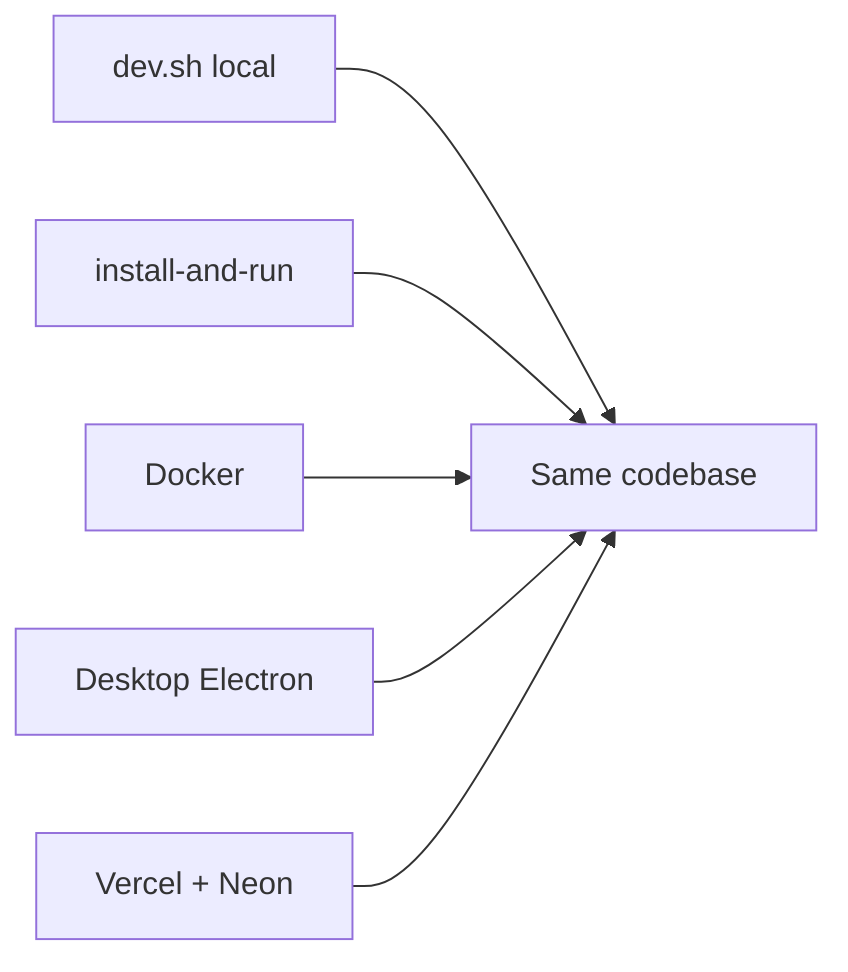
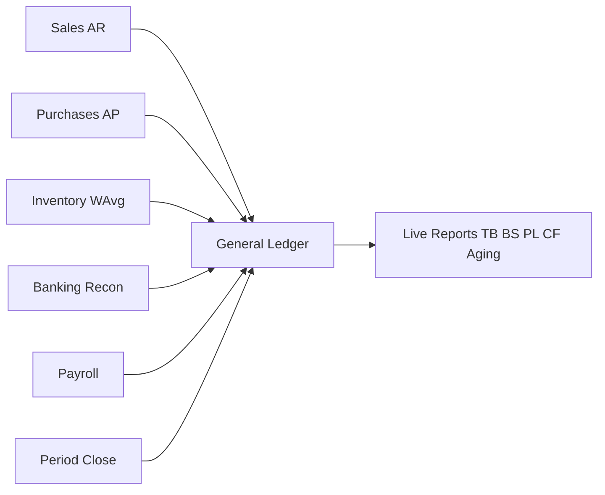
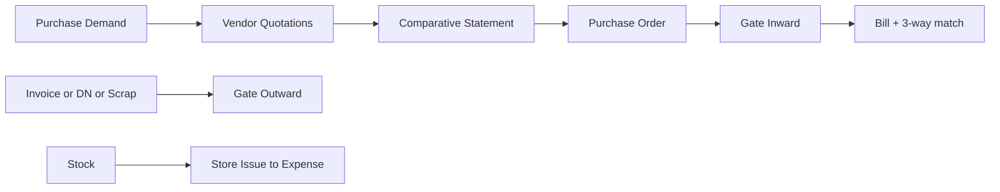
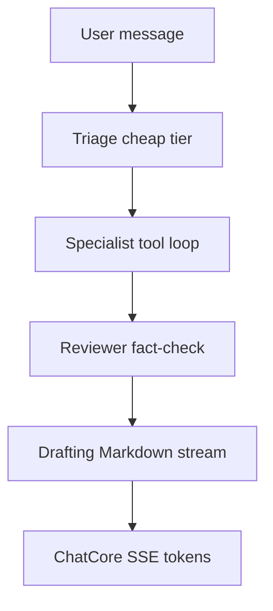

# Easy-Books — Project Review & Presentation Pack

> Mixed-audience brief: architecture diagrams (Mermaid), product thesis, and a **Good / Better / Best** competitive frame vs Odoo, QuickBooks Online, Manager.io, Xero, and Zoho Books.
>
> **Sources reviewed:** [`README.md`](../README.md), [`BLUEPRINT.md`](../BLUEPRINT.md), [`WORKFLOW.md`](../WORKFLOW.md), [`CLAUDE.md`](../CLAUDE.md), [`.claude/`](../.claude/), [`.remember/`](../.remember/), [`claude-improvement.md`](../claude-improvement.md).
>
> **Ground truth for current implementation:** prefer [`CLAUDE.md`](../CLAUDE.md) over older BLUEPRINT header notes (e.g. migrations — Alembic is source of truth) and over stale “still open” lines in early improvement audits.
>
> **Last assembled:** 2026-08-04

---

## 1. Title & thesis

**Easy-Books** is a multi-tenant, IAS/IFRS-aligned double-entry bookkeeping SaaS for SMEs.

It combines:

- Eight **business models** (CoA seed at signup — structural and irreversible) × installable modules (Odoo-style `MODULE_REGISTRY`, orthogonal to the CoA — **15** modules incl. Localization packs)
- **One GL writer** — [`backend/services/posting.py`](../backend/services/posting.py) — so every financial number on screen is derived live from the journal (no shadow-balance drift)
- Vertical depth rarely bundled in one SME product: contract manufacturing custody, telecom franchise, PRA e-invoice (Pakistan), hospital OPD/IPD/Lab, purchase→gate→store chain, weaving unit control, **yarn spinning with full GL costing**, and a multi-provider agentic AI assistant
- **IFRS Track A (shipped):** consolidation (IFRS 10), intercompany recon, leases (IFRS 16), IFRS 15 SSP + contract assets, assets depth (IAS 16/36), dimensional analytics, inventory depth (IAS 2), month-end close + auditor pack, tax rate history
- **Country packs (shipped):** Saudi ZATCA, India GST, Peppol / EU VAT, UAE VAT stub — plus withholding tax & CIT worksheet (#267)

**Positioning one-liner**

> Odoo depth for vertical workflows, QuickBooks familiarity for SME UX, Manager.io-style local ownership — with a modern FastAPI / Next.js stack, IFRS worksheet depth, and an agentic AI layer incumbents do not yet match in this segment.

---

## 2. What we reviewed

| Source | Role | Freshness note |
|--------|------|----------------|
| [`README.md`](../README.md) | Product elevator + features + how to run | Current feature catalog |
| [`BLUEPRINT.md`](../BLUEPRINT.md) | Canonical system blueprint (vision → API → tracks) | Header dated 2026-06-28; some §2 stack notes are stale — use CLAUDE for migrations / AI / purchase_store |
| [`WORKFLOW.md`](../WORKFLOW.md) | Narrative cycles + Dr/Cr maps + UI developer reference | Best for accounting flows |
| [`CLAUDE.md`](../CLAUDE.md) | Living agent / developer architecture | **Most current** implementation detail |
| [`.claude/`](../.claude/) | Verify skill, local settings, worktrees | Not product docs; see [`.claude/skills/verify/SKILL.md`](../.claude/skills/verify/SKILL.md) for UI proof |
| [`.remember/`](../.remember/) | Agent working memory (not `.memory/` — that path does not exist) | [`recent.md`](../.remember/recent.md), [`archive.md`](../.remember/archive.md) — Jul 2026 ship log |
| [`claude-improvement.md`](../claude-improvement.md) | Parity audit vs Odoo / QB / Manager / Bookkeeper | Useful framing; many listed gaps have since shipped |

**Suggested deeper reading order:** README → BLUEPRINT §§1, 4, 6 → CLAUDE.md → WORKFLOW cycle of interest → `.remember/archive.md` for what shipped lately.

---

## 3. Architecture

### 3.1 System context



| Layer | Choice |
|-------|--------|
| Backend | FastAPI + SQLModel, Decimal money (`NUMERIC(18,4)`) |
| Frontend | Next.js 16 App Router + React 19 + Tailwind v4 |
| DB | SQLite (dev / local installs) · PostgreSQL (production) |
| Migrations | Alembic (`backend/alembic/versions/`) — source of truth |
| Auth | JWT (HS256) + bcrypt; browser cookie + CSRF path supported |

### 3.2 Request + GL write path (design tenet)



**Design tenets** (from BLUEPRINT §1): one writer for the GL · Decimal money · multi-tenant by default · reversibility (mirror JVs) · versioning over in-place mutation for BoMs/rate plans · adaptive UI by business model · guidance everywhere.

### 3.3 Multi-tenancy + security layers



- Cross-tenant access returns **404** (no enumeration).
- Granular permissions: **74** resources in `PERMISSION_RESOURCES` with `perm_dep(resource, level)` and optional `my_data_only`.
- Period lock is enforced inside the posting service — locked periods reject writes.

### 3.4 Deploy surfaces



Data for script / Electron installs lives under `~/.easy-books` (never touched by update scripts). Demo tenants auto-seed on first empty DB (`SEED_DEMO=true` default).

---

## 4. Product surface — business models × modules

### 4.1 Dual axis

```mermaid
flowchart TB
  Signup[Signup picks business_model] --> CoA[Seed hierarchical CoA]
  Signup --> Mods[MODULES_BY_MODEL defaults]
  Mods --> Registry[MODULE_REGISTRY 9 modules]
  Registry --> Base[base always]
  Registry --> Ops[inventory production purchase_store]
  Registry --> Ind[telecom pra healthcare]
  Registry --> HR[hrm]
  Registry --> AI[ai_assistant]
  Apps[/apps store] --> Registry
```

**Business models (CoA seed):** `simple` · `services` · `trader` · `manufacturing` · `telecom_franchise` · `pra_einvoice` · `hospital` · `yarn_spinning`

**Modules (`MODULE_REGISTRY`):**

| ID | Category | Gates |
|----|----------|-------|
| `base` | Core | Overview, Ledger, AR, AP, Banking, Reports (always installed) |
| `inventory` | Operations | Inventory section |
| `production` | Operations | Manufacturing |
| `purchase_store` | Operations | Purchases + Store |
| `hrm` | HR | Payroll |
| `telecom` | Industry | Telecom franchise |
| `pra` | Industry | PRA e-Invoice (Pakistan) |
| `healthcare` | Industry | OPD / IPD / Lab / Procedures |
| `weaving` | Industry | Weaving unit control (memo/ops) |
| `spinning` | Industry | Yarn spinning mill (full GL) |
| `ai_assistant` | Intelligence | FAB + `/agent` (no sidebar section) |

`business_model` seeds the CoA once; `enabled_modules` controls UI and feature gates afterward — they are **orthogonal**.

---

## 5. Accounting & operations cycles

### 5.1 Core hub — everything posts to one GL



Reports (TB, BS, P&L, cash flow, aging, ledgers) compute live from journal lines. Hierarchical statements roll up via `services/account_tree.py` (leaf-only posting; parent balances are derived).

### 5.2 Purchase & Store chain (`purchase_store`)



- **Demand** — quantity-only requisition; self-approval blocked.
- **Comparative** — quotation matrix; lowest-or-justify approval; one CS per demand.
- **Gate Inward** — memo vs PO qty; price-free views for gate-only users.
- **Gate Outward** — dispatch for invoice / debit note / scrap (GL on scrap approve).
- **Store Issue** — departmental consumption: Dr Expense / Cr Inventory on create.

Narrative detail: [`WORKFLOW.md`](../WORKFLOW.md) purchase/store sections; API map in [`BLUEPRINT.md`](../BLUEPRINT.md) §8.

### 5.3 Vertical callouts (narrative slides)

| Track | Cycle (summary) | Doc |
|-------|-----------------|-----|
| **Manufacturing** | GRN (custodial intake) → Production Order stages → FG / value-add revenue; memo customer goods | WORKFLOW §4.7 |
| **Telecom franchise** | Tracker / load float → RSO chain → commissions / royalty / FCA | WORKFLOW §4.8 |
| **Healthcare** | OPD visit bill → IPD admission + charges → discharge invoice; Lab order → collect → result → deliver; pharmacy dispense | WORKFLOW §4.9 · BLUEPRINT §10C |
| **Yarn Spinning** | Bale receipt → multi-stage lot (carding→drawing→spinning) → cone output → dispatch with full GL WIP chain | WORKFLOW §4.11 · BLUEPRINT §10D |
| **PRA e-Invoice** | Invoice → PRA submit → Fiscal Invoice Number; portal mode | BLUEPRINT §10B |

---

## 6. Intelligence layer



| Stage | Behaviour |
|-------|-----------|
| **Triage** | Cheap, non-streaming; picks one of **11** specialist agents (5 base + 6 module-gated) |
| **Specialist** | Tool-calling loop (max 6 steps); **56** read-only tools over live reports; progress via `tool_start` / `tool_end` |
| **Reviewer** | Silent fact-check vs raw tool JSON; skipped when no tools ran |
| **Drafting** | Only stage that streams `token` events → polished Markdown for the user |

Providers: Anthropic · OpenAI · Gemini · Ollama (self-hosted). Tenant keys in Settings → AI; rate limit is **one decrement per user turn** (not per internal LLM call). Module gate: `ai_assistant`.

Surfaces: Sparkles FAB popup + full-page `/agent` (session sidebar).

---

## 7. Competitive frame — Good / Better / Best

**Peers:** Odoo 17 (Accounting + Inventory + apps) · QuickBooks Online · Manager.io · Xero · Zoho Books.

**Scoring:** **Best** = category-leading or rare combo · **Better** = clear edge · **Good** = parity · **Behind** = material gap (honest).

### 7.1 Where Easy-Books is Best

| Capability | Why Best vs market |
|------------|-------------------|
| **Single GL writer + live reports** | `posting.py` enforces ΣDr=ΣCr, period lock, Decimal money — no batch “balance” jobs that can drift |
| **Business-model CoA × Odoo-style modules** | Irreversible CoA seed + orthogonal module install; QB / Xero / Zoho lack this dual axis for verticals |
| **Pakistan + vertical depth in one product** | PRA e-invoice + telecom franchise + hospital (OPD/IPD/Lab) + contract manufacturing custody — not a typical QB / Xero / Zoho bundle |
| **Purchase control chain** | Demand → Quotation → Comparative (lowest-or-justify) → PO → Gate Inward → 3-way match → Gate Outward / Store Issue — Odoo-class procurement for SMEs |
| **AI Financial Assistant** | Multi-provider + 4-stage Triage → Specialist → Reviewer → Drafting + 56 tenant-scoped read-only tools — ahead of QB / Xero “Ask” for GL-grounded analysis |
| **Deploy flexibility** | Script installer / Docker / Electron / cloud — Manager / QB Desktop-like local ownership **and** modern SaaS |

### 7.2 Where Easy-Books is Better

| Capability | Edge |
|------------|------|
| Hierarchical CoA + rolled-up TB / BS / P&L | Parent roll-up; posting restricted to active leaves |
| Audit drill-down graph | JV ↔ source documents ↔ customer / vendor / product sub-ledgers |
| Report Builder | Whitelisted data-source registry + tenant-safe engine (no arbitrary SQL) |
| Ctrl+K universal search | Open tabs + static nav index + entity API in one palette |
| Themes / Urdu RTL / print hygiene | EN / UR / ZH; dot-matrix print discipline for SME ops |
| In-app git-based auto-update | Self-hosted updates without app-store friction |
| Granular permissions + `my_data_only` | Closer to Odoo ACL than QuickBooks’ coarse roles |

### 7.3 Where Easy-Books is Good (parity)

AR / AP · Credit / Debit Notes · payment allocations · advances · bank CSV import + reconciliation · weighted-average inventory · fixed assets + depreciation · deferred revenue (IFRS 15) · budgets vs actual · analytic / cost centres · payroll + attendance · multi-currency **backend** · comparative financial statements · period close · sales commissions · promotional discounts · multi-user RBAC · audit log · consolidation / leases / IC / dimensional P&L · ZATCA / India GST / Peppol · WHT + CIT worksheet.

### 7.4 Where Easy-Books is Behind (honest)

| Gap | Leaders | Note |
|-----|---------|------|
| Multi-currency UX / payment FX | Odoo, Xero, QB | Backend strong; document FX UI and payment FX incomplete |
| Ecosystem / marketplace / accountant network | QB, Xero, Odoo | No third-party App Store yet |
| Bank feeds (Open Banking / Plaid-class) | QB, Xero | CSV import + reconciliation + hardened feeds; not full Open Banking |
| Mature manufacturing MRP | Odoo | Custody / value-add strong; multi-output BoM, labour/overhead absorption still open |
| Global localization breadth | Odoo, Xero | PRA + ZATCA + India GST + Peppol + UAE VAT shipped; more jurisdictions still open |
| Native mobile apps | QB, Xero | Responsive web (sm/md data-entry cards) + BottomNav; no iOS / Android apps |
| Commercial scale / SOC 2 marketing / support org | Incumbents | Product controls (tenant isolation, RBAC, audit) exist; go-to-market maturity differs |

### 7.5 Side-by-side snapshot

| Dimension | Easy-Books | Odoo | QuickBooks Online | Manager.io | Xero / Zoho |
|-----------|------------|------|-------------------|------------|-------------|
| Double-entry rigor | **Best** (single writer) | Better | Good | Better | Good |
| Module / apps model | **Better** (14 focused + Localization) | **Best** (ecosystem) | Behind | Good | Good |
| Vertical industry packs | **Best** (PRA, telecom, hospital, mfg custody) | Better (many apps) | Behind | Behind | Behind |
| SME UX familiarity | Better (QB-inspired presets / hubs) | Good | **Best** | Good | Better |
| Local / offline-first install | **Best** (script + Electron) | Good | Behind (cloud-first) | **Best** | Behind |
| AI on live GL tools | **Best** (agentic + multi-provider) | Good | Good | Behind | Good |
| Bank feeds / ecosystem | Behind | Better | **Best** | Behind | **Best** |

---

## 8. Honest gaps & roadmap hooks

From [`BLUEPRINT.md`](../BLUEPRINT.md) §19 and current CLAUDE notes (verify before citing as “open”):

**Still typically called out as open / partial**

- Multi-currency on payments; fuller FX UI
- Manufacturing: production-order reversal helper, overhead/labour absorption, partial delivery, multi-output BoMs / by-products
- Playwright E2E coverage for full UI lifecycles
- Storybook for guidance / form patterns

**Recently shipped (do not present as gaps)** — payroll, overdue sweep + reminders, purchase_store P1–P4, Gate Outward scrap GL, report pagination on Purchases/Store registers, AI triage/specialist/reviewer/drafting + full agent roster, Ollama provider, hierarchical statements, CN/DN, deferred revenue engine, fixed assets depth (#258), budgets, analytic dimensions + dimensional P&L (#260), IFRS 15 SSP/contract assets (#259), consolidation + intercompany (#255/#261), IFRS 16 leases, ZATCA/India GST/Peppol country packs, WHT + CIT (#267), Alembic migrations.

Parity audit methodology and historical gap IDs: [`claude-improvement.md`](../claude-improvement.md) (cross-check against CLAUDE before using any “still open” claim).

---

## 9. Appendix — 12-slide outline

| # | Slide | Visual | Speaker notes |
|---|-------|--------|---------------|
| 1 | **Title** — Easy-Books for SMEs | Brand + thesis one-liner | Multi-tenant double-entry; IAS/IFRS; seven models |
| 2 | **Problem** | “Rigorous books without ERP complexity” | Locked periods, audited reversals, live GL — without Odoo’s learning curve |
| 3 | **Architecture** | Diagram 3.1 + 3.2 | FastAPI + Next; one `posting.py` writer; Decimal; tenant_id everywhere |
| 4 | **Models × Modules** | Diagram 4.1 | CoA from business_model; UI from modules; `/apps` store |
| 5 | **Core accounting** | Diagram 5.1 | AR/AP/inventory/bank/payroll → one GL → live reports |
| 6 | **Purchase & Store** | Diagram 5.2 | Odoo-class procure-to-pay for SMEs; 3-way match |
| 7 | **Verticals** | Table 5.3 | Manufacturing custody · Telecom · Hospital · PRA Pakistan |
| 8 | **AI Assistant** | Diagram 6 | Triage → Specialist → Reviewer → Draft; 11 agents; 4 providers |
| 9 | **Security & deploy** | Diagrams 3.3 + 3.4 | RBAC + sparse overrides; script / Docker / Electron / cloud |
| 10 | **Competitive Best / Better** | Tables 7.1–7.2 | Moat: verticals + GL rigor + AI + deploy flexibility |
| 11 | **Parity & gaps** | Tables 7.3–7.4 | Honest: bank feeds, FX UX, MRP depth, ecosystem |
| 12 | **Close / ask** | Positioning one-liner | Demo path: eight demo tenants (`demo1234`); docs index |

---

## 10. Appendix — reading order

1. [`README.md`](../README.md) — product + run modes  
2. [`BLUEPRINT.md`](../BLUEPRINT.md) §§1, 4, 6 — vision, architecture, models/modules  
3. [`CLAUDE.md`](../CLAUDE.md) — current implementation truth  
4. [`WORKFLOW.md`](../WORKFLOW.md) — cycle you are presenting  
5. [`docs/ROADMAP.md`](./ROADMAP.md) + [`.remember/archive.md`](../.remember/archive.md) — ship history  
6. [`USER_GUIDE.md`](../USER_GUIDE.md) or in-app `/guide` — end-user narrative  

---

## Document maintenance

When shipping a feature that changes architecture, modules, AI pipeline, or competitive posture, update this pack’s diagrams or Good/Better/Best tables in the same PR as [`CLAUDE.md`](../CLAUDE.md) / BLUEPRINT notes.
